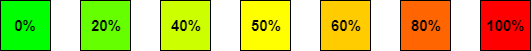

# green-to-red

[](https://www.npmjs.com/package/green-to-red)
[](https://www.npmjs.com/package/green-to-red)
[](https://github.com/radulucut/green-to-red/blob/master/LICENSE)

Get a color from a green to red scale



## Install
```
$ npm install green-to-red --save
```

## Usage
```javascript
const greenToRed = require('green-to-red');

greenToRed(0);          // Output -> [0, 255, 0]
greenToRed(20, true);   // Output -> #32ff00
greenToRed(100, true);  // Output -> #ff0000
```

## Demo
https://radulucut.github.io/green-to-red/demo/